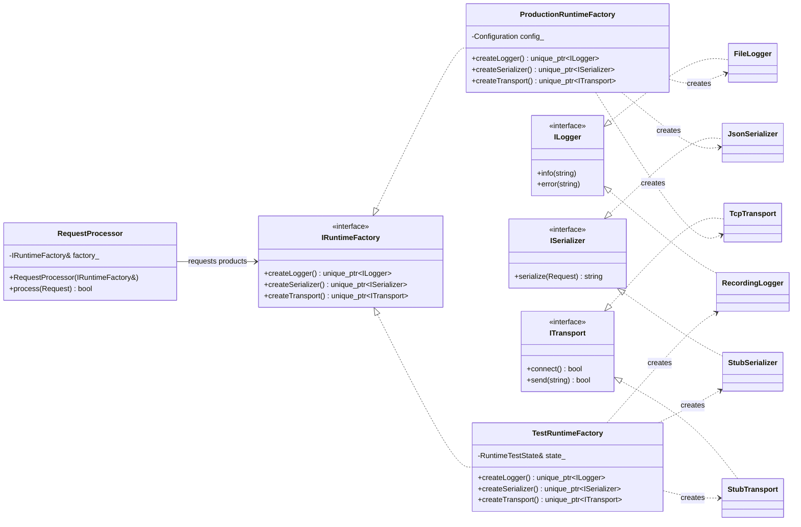
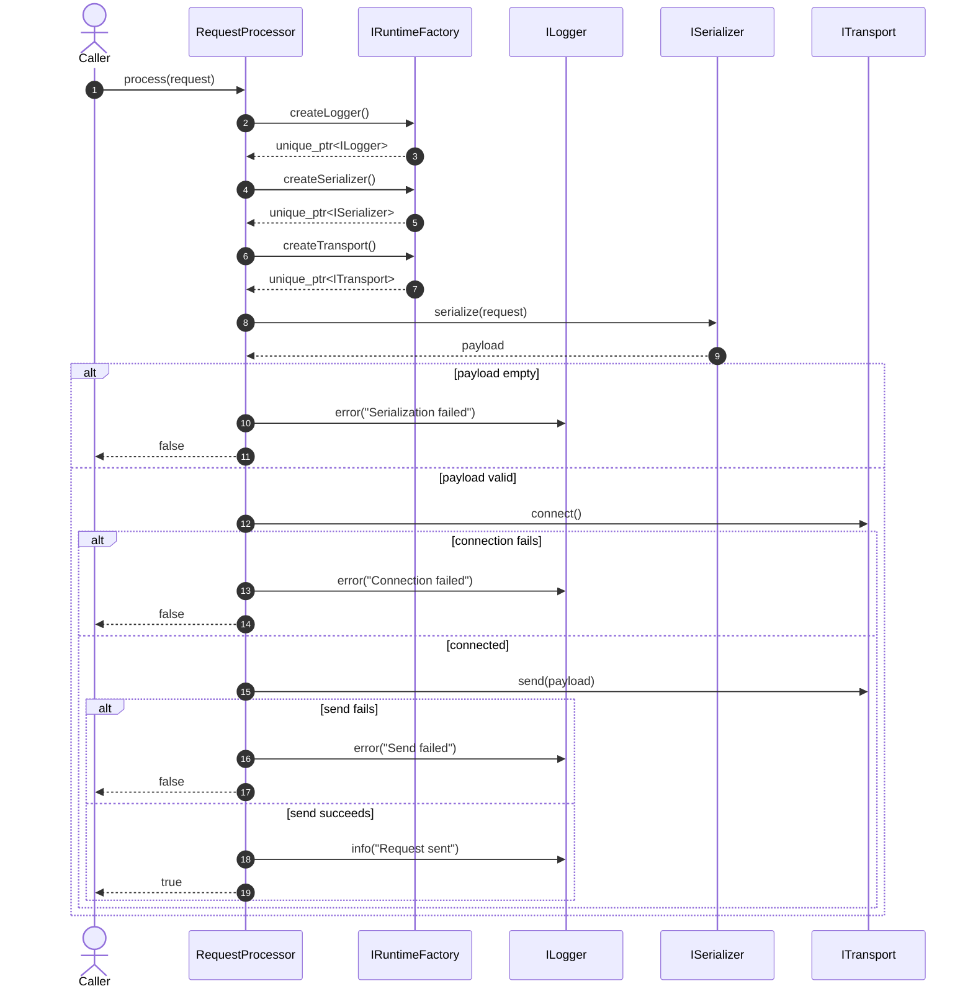
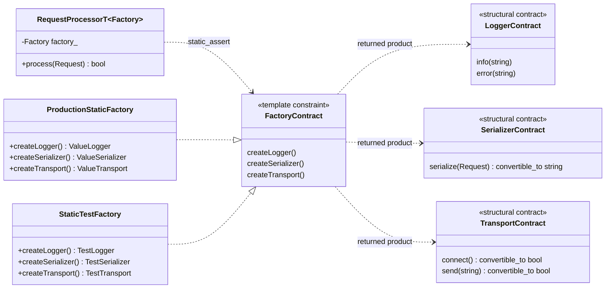
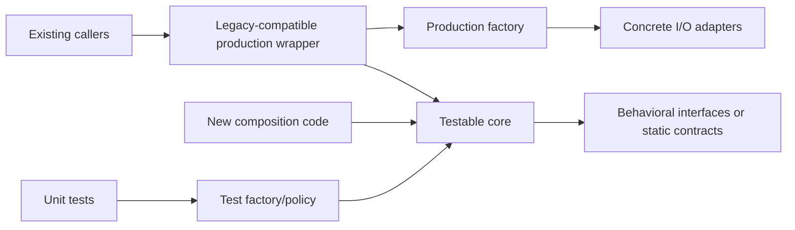
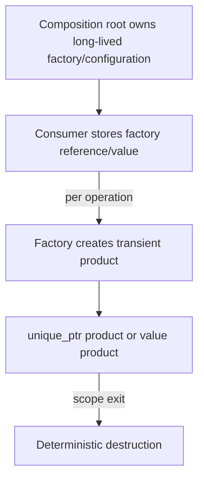

# UML Reference

These Mermaid diagrams are source-controlled UML documentation. Update names and operations to match the repository rather than copying them blindly.

## Runtime Abstract Factory — class diagram

## Runtime processing — sequence diagram

## Compile-time factory — class diagram

## Incremental legacy migration — component view

## Ownership model

Use aggregation/composition carefully:

- A reference member means the consumer does not own the factory.
- A factory returned as a value is owned by the consumer.
- `unique_ptr<Product>` transfers sole ownership to the caller.
- A shared test-state object may outlive transient test products so assertions remain possible after product destruction.
